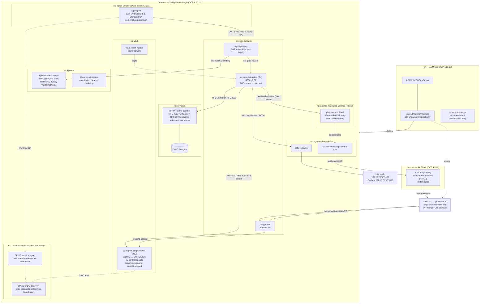

# Architecture — Zero-Trust Agentic AI Platform (PoC)

## 1. System overview

This PoC proves that an AI agent can call downstream tools **on a user's behalf without
ever holding a credential**, and can obtain **just-in-time, time-boxed elevated access**
only after an explicit human approval — with every action attributable to an identity and
an approval, and every grant auto-revoked by construction.

The platform is built from exactly **one** piece of custom code — the `ext-proc-delegation`
Go service — wired into a supported vendor stack: Red Hat Zero Trust Workload Identity
Manager (SPIRE), Red Hat Build of Keycloak (RHBK), HashiCorp Vault, the Linux Foundation
`agentgateway`, Kyverno, OpenShift Sandboxed Containers (Kata), and AAP Event-Driven
Ansible. This "one custom component, everything else supported" shape is the core
supportability argument for a regulated-bank context.

The two flows the platform must demonstrate:

- **UC1 — Delegated MCP tool call.** A Kata-isolated agent pod presents its SPIFFE
  JWT-SVID, the gateway authenticates it, Kyverno authorizes the specific tool, and the
  delegation service exchanges the agent identity for the **user's** federated token (scoped
  to the downstream audience) plus a per-tool Vault secret — so the upstream `pfsense-mcp`
  server sees the **user**, never the agent.
- **UC2 — JIT escalation.** A denial triggers a scoped access request; the request becomes a
  Gitea pull request; a human (Arsalan) merging the PR is the approval; an HMAC-verified
  webhook drives the approver to mint a **Vault-issued, lease-bound ephemeral Kubernetes
  identity** (SA + Role + RoleBinding, TTL = approval window). The agent acts as that
  identity; Kube audit attributes every call to it; Vault lease expiry deletes it.

### Design invariants (non-negotiable)

| Invariant | How it is enforced |
|---|---|
| No credential in etcd / git / agent pod | Vault Agent Injector → tmpfs only; agents never read a long-lived secret; delegation service holds creds in memory for the duration of a single request |
| Downstream sees the user, not the agent | Keycloak RFC 8693 exchange to downstream audience inside `ext-proc-delegation`; agent SVID never forwarded upstream |
| Fail closed | Gateway `extAuthz` and `extProc` are required filters; if Kyverno or the delegation service is unreachable, the request is denied, not allowed |
| Auto-revoke is structural, not procedural | Vault Kubernetes secrets-engine lease TTL deletes the SA+Role+RoleBinding; no cron in the revocation path (Kyverno cleanup is only a backstop) |
| Attribution everywhere | SPIFFE ID per workload, user identity downstream, `jit-<agent>-<session>` SA in Kube audit, OTel trace tying request → approval → action, structured audit to Loki with **args sha256-hashed** |
| Default-deny network | NetworkPolicy default-deny in every namespace, explicit allows only |

---

## 2. Component diagram



---

## 3. Use-case sequence diagrams

### UC1 — Delegated MCP tool call

The agent never sees a credential; the upstream `pfsense-mcp` always sees the **user**.

```mermaid
sequenceDiagram
    autonumber
    participant Agent as Agent pod (Kata)<br/>ns agent-sandbox
    participant SPIRE as SPIRE Workload API
    participant AGW as agentgateway<br/>ns mcp-gateway
    participant Kyverno as kyverno-authz-server<br/>:9081 ext_authz
    participant Ext as ext-proc-delegation<br/>:9000 ext_proc
    participant KC as Keycloak (realm agentic)
    participant Vault as Vault
    participant PF as pfsense-mcp :8000<br/>ns agentic-mcp
    participant Obs as Loki + OTel

    Agent->>SPIRE: fetch JWT-SVID (aud=mcp-gateway)
    SPIRE-->>Agent: JWT-SVID spiffe://anaeem.na-launch.com/ns/agent-sandbox/sa/<sa>
    Agent->>AGW: POST /mcp  (Bearer JWT-SVID + user context)<br/>MCP JSON-RPC tools/call {tool, args}

    Note over AGW: JWT authn — validate SVID against<br/>SPIRE OIDC JWKS; map claims to<br/>metadata dev.agentgateway.jwt
    AGW->>Kyverno: ext_authz Check(tool, agent-SVID claims, user)
    alt tool NOT allowed for this identity
        Kyverno-->>AGW: DENY
        AGW-->>Agent: 403 (fail closed) → triggers UC2 estimate
    else tool allowed
        Kyverno-->>AGW: ALLOW
    end

    AGW->>Ext: ext_proc stream — request headers + buffered body
    Note over Ext: parse claims from metadata;<br/>extract {tool, args} from JSON-RPC body
    Ext->>KC: leg 0/1 — RFC 7523 jwt-bearer<br/>(SVID → token, preview) then<br/>RFC 8693 exchange → aud=pfsense-mcp
    KC-->>Ext: user-federated access token (downstream audience)
    Ext->>Vault: leg 2 — login auth/jwt (own JWT-SVID)
    Vault-->>Ext: Vault token (policy: per-tool secret read)
    Ext->>Vault: read per-tool secret (e.g. pfSense API key)
    Vault-->>Ext: short-lived secret (held in memory only)
    Note over Ext: inject Authorization: Bearer <user token><br/>+ per-tool secret header; clear agent SVID
    Ext-->>AGW: mutated request headers
    AGW->>PF: POST /mcp  (user identity, no agent SVID)
    Note over PF: pfsense-mcp sees the USER,<br/>never the agent
    PF-->>AGW: MCP response
    Note over Ext: response leg — STRIP credential/auth<br/>headers (cred echo test); body-proc SKIP by default
    AGW-->>Agent: response (credential-stripped)
    Ext->>Obs: audit event (args sha256-HASHED) + OTel span<br/>request→exchange→upstream
```

### UC2 — JIT escalation (deny → Gitea PR → merge → ephemeral identity → auto-revoke)

```mermaid
sequenceDiagram
    autonumber
    participant Agent as Agent pod (Kata)
    participant AGW as agentgateway / Kyverno
    participant JIT as jit-approver :8080<br/>ns mcp-gateway
    participant Gitea as Gitea (git.arsalan.io)
    participant Human as Arsalan (approver)
    participant Vault as Vault<br/>kubernetes secrets engine
    participant Kube as Kube API + audit
    participant Obs as Loki + OTel

    Agent->>AGW: privileged action / tool call
    AGW-->>Agent: DENY (fail closed)
    Note over Agent: SKILL.md: estimate scope<br/>{ns, verbs, resources, duration, justification}<br/>enforce scope CEILING
    Agent->>JIT: POST /request  {scope, session-id, justification}
    Note over JIT: validate against ceiling;<br/>reject if over-ceiling (new request rule)
    JIT->>Gitea: open PR — scoped grant manifest + estimate + paper trail
    Gitea-->>Human: PR notification (PR comments replace Slack)
    Human->>Gitea: review + MERGE PR  (the approval act)
    Gitea->>JIT: merge webhook (HMAC-signed payload)
    Note over JIT: verify HMAC + repo allowlist;<br/>reject forged/unsigned webhooks
    JIT->>Vault: read kubernetes/creds/jit-scoped<br/>(approver-only Vault policy)
    Note over Vault: generated_role_rules = approved scope;<br/>allowed_kubernetes_namespaces = approved ns;<br/>token TTL = approval window
    Vault->>Kube: create SA jit-<agent>-<session> + Role + RoleBinding
    Vault-->>JIT: ephemeral SA token (lease-bound)
    JIT-->>Agent: token via Vault injector (tmpfs)
    Agent->>Kube: perform approved actions (as jit-<session> SA)
    Note over Kube: Kube audit attributes every call<br/>to jit-<agent>-<session>
    Note over Vault,Kube: lease TTL expires →<br/>Vault deletes SA+Role+RoleBinding (auto-revoke)<br/>Kyverno cleanup = backstop only
    JIT->>Gitea: summary comment on PR<br/>(actions taken, audit refs, revoke confirmed)
    JIT->>Obs: audit event + OTel span (request→approval→action→revoke)
    Note over Agent: riskier follow-on = NEW request,<br/>never silent escalation
```

---

## 4. Placement map — what runs where

| Component | Cluster | Namespace | Exists / Create | Role in flows |
|---|---|---|---|---|
| SPIRE server + agent + OIDC | **anaeem** | `zero-trust-workload-identity-manager` | create (ZTWIM `stable-v1`) | UC1: issues agent JWT-SVID; OIDC trust for Vault |
| RHBK Keycloak (realm `agentic`) + CNPG | **anaeem** | `keycloak` | create (our own RHBK Subscription+OG; CNPG operator exists) | UC1: RFC 7523 + RFC 8693 federated user tokens |
| Vault (raft single-replica) + injector | **anaeem** | `vault` | create (helm 0.32.0) | UC1: per-tool secrets; UC2: kubernetes engine `creds/jit-scoped` |
| agentgateway | **anaeem** | `mcp-gateway` | create | UC1/UC2: JWT authn, extAuthz, extProc chain |
| ext-proc-delegation (Go) | **anaeem** | `mcp-gateway` | create (THE custom build) | UC1: token exchange + secret fetch + inject + strip |
| jit-approver | **anaeem** | `mcp-gateway` | create | UC2: PR open + webhook verify + Vault creds issuance |
| kyverno + authz server | **anaeem** | `kyverno` | create | UC1: tool RBAC allow/deny; UC2: cleanup backstop |
| pfsense-mcp + demo MCP servers | **anaeem** | `agentic-mcp` (Data Science Project) | create | UC1: downstream that must see user identity |
| agent pods (Kata runtimeClass) | **anaeem** | `agent-sandbox` | create | UC1/UC2: the workload identity origin |
| OTel collector + AlertManager denial rule | **anaeem** | `agentic-observability` | create | audit/metrics → Loki; denial → EDA trigger |
| RHOAI DataScienceCluster `data-skill-factory` | **anaeem** | (RHOAI) | **EXISTS — do not recreate** | hosts the agentic-mcp Data Science Project |
| ArgoCD `openshift-gitops` + ACM GitOpsCluster | **virt** | `openshift-gitops` | exists | GitOps source-of-truth driving all `platform/` |
| Future cross-cluster MCP upstreams | **virt** | `aap-mcp-server` | exists (reference as commented examples only) | not in PoC critical path |
| AAP 2.6 (EDA, Event Streams, job templates) | **hammer** | n/a (config-only) | exists | self-healing loop: denial → remediation PR |
| Gitea 13 | external | — | exists (`git.arsalan.io`) | GitOps source + JIT/remediation PR approval channel (no Slack) |
| Grafana + Loki | external | — | exists (`172.16.2.252`) | audit + observability sink (`LOKI_PUSH_URL` parameterized) |
| Container registry | external | — | exists (`oci.arsalan.io/nvidia-ida`) | images `<name>:dev` |

**Placement rationale.** All PoC platform components land on **anaeem** (the SNO platform
target) so the entire identity + delegation + isolation critical path lives in one cluster
with one trust domain — federation across clusters is explicitly out of scope for the PoC.
**virt** stays the GitOps control plane only (ArgoCD + ACM), keeping the deploy mechanism
off the data path. **hammer** runs AAP unchanged (config-only), so the self-healing loop is
an integration, not a new install. Gitea and the registry/observability endpoints are
external shared services parameterized through `environment/clusters.yaml`.

---

## 5. Apply order (mirrors README; GitOps app-of-apps enforces dependencies)

1. `platform/spire` — workload identity foundation (trust domain is immutable once created)
2. `platform/keycloak` — user identity (CNPG operator already present)
3. `platform/vault` — secrets engine; establish Vault ↔ SPIRE OIDC trust
4. `platform/kyverno` — policy + ext_authz server
5. `platform/mcp-gateway` — agentgateway + ext-proc-delegation + jit-approver
6. `platform/agentic-mcp` — demo MCP servers (pfsense-mcp)
7. `platform/agent-sandbox` — Kata agent namespace
8. `platform/agentic-observability` — OTel + AlertManager denial rule
9. `gitops/` — ArgoCD ApplicationSets (idempotent)

---

## 6. Cross-references

- Threat boundaries and STRIDE per hop: [threat-model.md](./threat-model.md)
- SWOT and the 6-point PoC sign-off gate: [swot.md](./swot.md)
- JIT mechanism design of record: [jit-sub-identity.md](./jit-sub-identity.md)
- Decisions: [0001 ext_proc language](./decisions/0001-extproc-language-go.md),
  [0002 JIT via Vault k8s engine](./decisions/0002-jit-grant-vault-k8s-engine.md),
  [0003 Keycloak token-exchange strategy](./decisions/0003-keycloak-token-exchange-strategy.md),
  [0004 extProc vs extAuthz split](./decisions/0004-extproc-vs-extauthz-split.md),
  [0005 no Slack / Gitea PR approval](./decisions/0005-no-slack-gitea-pr-approval.md)
