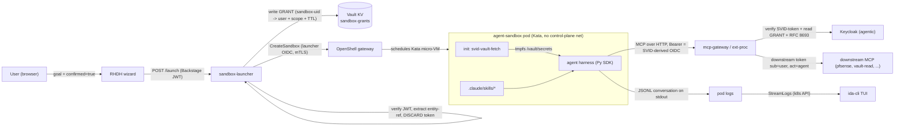
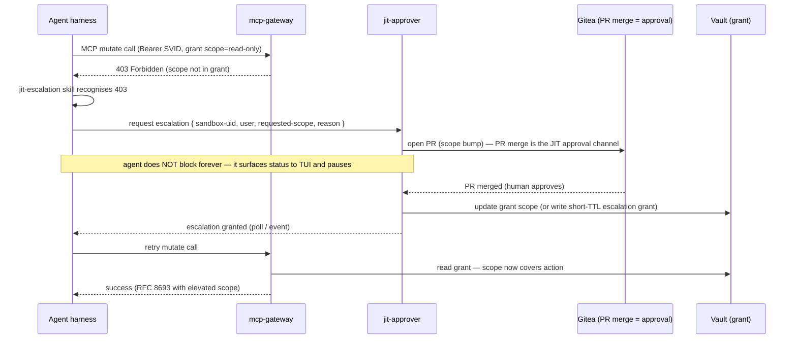
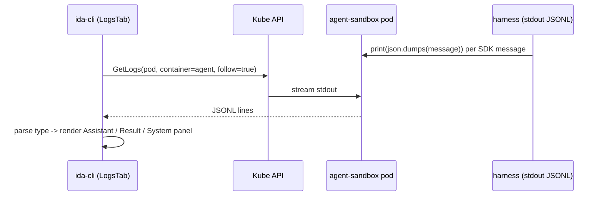

# Design: In-Sandbox Agent Harness (skill-driven, delegated-identity MCP)

## Status
Proposed

## Date
2026-06-15

## Purpose and scope

Replace the Phase-5c device-flow demo agent with an **autonomous, headless,
skill-driven Claude Agent SDK harness** that runs inside the Kata-isolated
`agent-sandbox` pod. The harness:

- runs **without a human present** (no device-flow, no browser approval),
- obtains a **delegated identity** that lets the platform attribute its MCP
  calls to the launching **user** (not the agent service account),
- discovers behaviour from **filesystem skills** (`.claude/skills/`),
- calls **MCP through the gateway** with that delegated identity,
- streams its conversation back to the **TUI** (ida-cli),
- and handles **403 -> JIT escalation** without crashing.

The delegated-identity mechanism is **OPAQUE to the user**: the user states a
goal in the RHDH wizard, consents once, and never sees, holds, or pastes a
token. The agent never sees the user's credential either.

Out of scope: multi-agent orchestration, persistent agent memory, GPU
provisioning workflows (those reuse this harness later).

---

## 1. Architecture (diagram-in-words)



**Narrative flow:**

1. **TUI / RHDH launches.** The user enters a goal in the RHDH wizard (or
   `ida-cli`), confirms, and the request hits `sandbox-launcher` `POST /launch`
   carrying the user's Backstage/Keycloak JWT.
2. **Launcher records consent, not credential.** The launcher verifies the
   JWT, extracts the entity-ref, **discards the token** (current behaviour,
   `api.py` line 209), and writes a **grant** to Vault keyed by the new
   sandbox's UID: `{ user, scope, ttl, created, nonce }`. It then calls
   OpenShell `CreateSandbox` with its **own** OIDC token over mTLS.
3. **Agent SDK harness boots in the sandbox.** The `svid-vault-fetch` init
   container fetches the agent's inference credential and OIDC client secret to
   tmpfs (unchanged). The Python harness reads its goal and active skills,
   discovers skills from `.claude/skills/`, and calls the SDK `query()`.
4. **Delegated MCP through the gateway.** Each MCP request carries a Bearer
   token derived from the **agent's own SPIFFE SVID** plus a reference to the
   stored grant. `ext-proc` verifies the SVID-token, validates the grant, and
   performs the **RFC 8693 token exchange** at the gateway boundary, producing a
   downstream token whose `sub` is the **user** and whose `act` is the **agent**.
5. **Downstream sees the user.** Downstream MCP servers (pfSense, vault-read)
   receive a user-scoped token and apply user-level authorization.
6. **Conversation streams to the TUI** via pod-log JSONL (Phase 1).

---

## 2. Credential / identity flow — the keystone

### Chosen design: Option D — On-Behalf-Of via SVID + stored user grant

This is the **only** option that simultaneously upholds the
no-credential-passing invariant AND makes downstream see the user. Options A
(refresh-token to tmpfs) violates the invariant; Options B/C (agent acts as
itself) lose user attribution and break the UC1 invariant "downstream sees the
user, not the agent."

### Primary delegated-call sequence

```mermaid
sequenceDiagram
    participant A as Agent harness (sandbox)
    participant SP as SPIRE Workload API
    participant GW as ext-proc (mcp-gateway)
    participant VG as Vault (sandbox-grants)
    participant KC as Keycloak (agentic)
    participant DS as Downstream MCP (pfsense)

    A->>SP: fetch JWT-SVID (aud=mcp-gateway)
    SP-->>A: SVID (ephemeral, auto-rotated)
    A->>GW: MCP call, Bearer=SVID-token, header X-Sandbox-UID
    GW->>GW: verify SVID against SPIRE/Keycloak JWKS
    GW->>VG: read grant by sandbox-uid (ext-proc SVID -> Vault)
    alt grant missing / expired / scope mismatch
        VG-->>GW: not found / stale
        GW-->>A: 403 Forbidden (deny path, audited)
    else grant valid
        VG-->>GW: { user, scope, ttl, nonce }
        GW->>GW: AUDIT: impersonation attempt (grant-id, actor=SVID, user)
        GW->>KC: RFC 8693 token exchange<br/>(actor=agent, requested_subject=user, scope from grant)
        KC-->>GW: downstream token (sub=user, act.sub=agent)
        GW->>DS: MCP call, Bearer=downstream token
        DS->>DS: authorize as USER; AUDIT access
        DS-->>GW: result
        GW-->>A: result
    end
```

### Why this upholds no-credential-passing (rigorous trace)

Every credential/secret relevant to the design, traced origin -> consumer:

| Secret | Origin | Consumed by | Crosses a boundary? | Permitted flow |
|--------|--------|-------------|---------------------|----------------|
| User Keycloak access token | RHDH login | launcher (verify only), then `del` (api.py:209) | No — discarded at launcher | n/a (never forwarded) |
| User refresh token | — | — | **Never obtained** | n/a |
| **Grant** (`{user,scope,ttl,nonce}`) | launcher writes to Vault | ext-proc reads from Vault | Yes, but it is a **reference/consent record, not a credential** | KV via Vault auth; not presentable to any endpoint |
| Agent SVID | SPIRE Workload API | agent harness; ext-proc (as actor) | Stays with the workload that requested it | SPIRE SVID via Workload API (permitted) |
| ext-proc SVID -> Vault token | SPIRE -> Vault auth/jwt | ext-proc only | No | SPIRE SVID + Vault, in-component |
| mcp-gateway client secret | Vault Injector -> tmpfs | ext-proc only | No | Vault Injector to tmpfs (permitted) |
| Agent inference cred / OIDC secret | Vault Injector -> tmpfs | agent harness only | No | Vault Injector to tmpfs (permitted) |
| Downstream user token | **Keycloak issues at the gateway** | injected onto the downstream MCP call | Created and consumed at the boundary | RFC 8693 exchange at the gateway (permitted) |

**The grant is not a credential.** It cannot be presented to any endpoint to
obtain access. It is a consent record that `ext-proc` validates and then uses
to *instruct* Keycloak to mint a user-scoped token, using mcp-gateway's
**pre-authorized impersonation right**. The actual token minting happens inside
Keycloak. An attacker who steals the grant reference still cannot use it without
(a) a valid SVID from the `agent-sandbox` namespace and (b) the mcp-gateway
service-account secret. The grant alone is inert.

**Fail-closed.** Grant missing, expired (TTL checked by ext-proc *at read
time*, not just by Vault lease), or scope mismatch -> immediate `403`. There is
no degraded-but-allowed path.

**No user credential ever transits launcher -> sandbox.** The launcher writes a
grant; the agent never reads it (only ext-proc does). The agent authenticates
to the gateway with its **own** SVID. This is the load-bearing difference from
Option A.

### Identity & trust model

- **Agent SVID:** `spiffe://anaeem.na-launch.com/ns/agent-sandbox/sa/openshell-agent`
  (audience `mcp-gateway`) — the actor identity.
- **ext-proc SVID:** identity for reading grants from Vault and exchanging at
  Keycloak.
- **Keycloak scopes:** mcp-gateway client has `standard.token.exchange.enabled`
  (already set, ADR-0003) and impersonation permission for users in the
  `mcp-users` group. Phase 2 adds `actor_token` for explicit `act.sub`.
- **Network boundary:** `agent-sandbox` has **no** route to control-plane
  components except the public `mcp-gateway` route. It cannot reach Vault,
  Keycloak token endpoints, or the launcher directly. SPIRE Workload API is a
  local unix socket, not a network call.

### Phasing

- **Phase 1 (PoC):** grant-backed impersonation. ext-proc exchanges *as*
  mcp-gateway with `requested_subject=user`; downstream token has `sub=user`
  (no `act.sub`). Audit captures actor via ext-proc logs.
- **Phase 2 (prod):** full `actor_token=agent-SVID` so the downstream token
  carries both `sub=user` and `act.sub=agent` (RFC 8693 §4.4). Gated on RHBK
  version validation.

`[SECURITY-OPEN]` Keycloak fine-grained impersonation permission must be scoped
so mcp-gateway can impersonate **only** `mcp-users`, never arbitrary users.
Validate before Accepted.

`[SECURITY-OPEN]` Grant must be keyed by **sandbox-uid (immutable)** plus a
nonce, never by sandbox-name (mutable/reusable), to prevent name-collision
grant theft.

---

## 3. Skill mechanism

Skills are **filesystem artifacts**, not a programmatic API. They must exist on
disk before `query()` is called.

- **Where they live:** baked into the sandbox image at the repo-root
  `.claude/skills/<skill-name>/SKILL.md`. The harness sets
  `setting_sources=["project"]` and `cwd` at the repo root so the SDK discovers
  them.
- **How injected / activated:** the active skill set is selected per launch.
  The launcher records requested capabilities; the harness maps capabilities ->
  `skills=[...]` (or `skills="all"`). Skills are baked into the image (immutable,
  auditable) — they are **not** injected as env or fetched at runtime, which
  keeps the sandbox supply chain verifiable.
- **Progressive disclosure:** only `name`+`description` (<=1536 chars) load at
  startup; the body loads when the model deems the skill relevant.
- **Caveat:** the `allowed-tools` frontmatter field is **ignored under the
  SDK** — tool permission is enforced in code via
  `ClaudeAgentOptions(allowed_tools=[...])`.

### Example skill: `fetch-firewall-rules` (mcp-pfsense)

Path: `.claude/skills/fetch-firewall-rules/SKILL.md`

```markdown
---
name: fetch-firewall-rules
description: >
  Read the current pfSense firewall rules, NAT rules, or alias definitions
  via the mcp-pfsense MCP server. Use when the user asks to see, list, audit,
  or summarise firewall configuration. READ-ONLY — never create, update, or
  delete rules from this skill.
when_to_use: >
  Triggered by: "show firewall rules", "list NAT", "what is allowed",
  "audit the firewall", "which ports are open".
---

## Instructions

1. To list rules, call `mcp__agentgateway__pfsense_list_rules` (or the
   equivalent search/list tool) BEFORE any per-rule lookup. Rule IDs are
   non-persistent array indices and shift after edits — always list first.
2. Summarise rules for the user: source, destination, port, action, descr.
3. This skill is READ-ONLY. If the user asks to change a rule, DO NOT call any
   update/delete tool. Instead state that mutation requires the
   `manage-firewall` capability and trigger the JIT escalation path
   (see jit-escalation skill).
4. If a tool call returns 403, stop and follow the JIT escalation loop; do not
   retry blindly.
```

Tool permissions are granted in code:
`allowed_tools=["mcp__agentgateway__pfsense_list_*", "Read"]`.
The read-only intent is enforced **twice**: by the skill instructions AND by the
`allowed_tools` allow-list (defence in depth — a prompt-injected agent still
cannot call a mutate tool that is not in the allow-list).

---

## 4. The 403 -> JIT-escalation loop

The agent runs `permission_mode="dontAsk"` — anything not in `allowed_tools` is
denied locally. But a tool **in** the allow-list can still return `403` from the
gateway when the **grant scope** does not cover the requested action (e.g.
read-only grant, agent attempts a write tool). This is the escalation trigger.



Rules:
- The agent **never** receives or holds an elevated credential. Escalation
  mutates the **grant** in Vault; the gateway still does the exchange.
- Deny is **fail-closed**: a `403` with no merged escalation stays a `403`.
- The agent surfaces "waiting on approval" to the TUI rather than hanging
  silently; it bounds its wait (poll with timeout) and reports timeout as a
  terminal result, not a silent allow.
- This reuses the existing `jit-approver` + Gitea PR-merge channel (ADR-0005,
  no Slack) and the existing JIT grant pattern (ADR-0002).

`[SECURITY-OPEN]` Confirm whether escalation widens the existing grant in place
or writes a separate short-TTL escalation grant the gateway unions at read time.
The latter is cleaner for audit and revocation.

---

## 5. TUI conversation streaming

The harness emits **one JSON object per line (JSONL)** to **stdout** for every
SDK message (`SystemMessage`, `AssistantMessage`, `ResultMessage`). This reuses
the TUI's existing pod-log streaming path — **no new public route required for
the PoC**.



- **Chosen (Phase 1):** Option B from research — agent writes framed JSONL to
  stdout; TUI `StreamLogs` (kube.go:15, `Container: "agent", Follow: true`)
  already captures it. The TUI parses `type` and renders into the conversation
  panel instead of a raw log dump.
- **Deferred:** `conversationUrl` is hardcoded `null` today
  (`api.py:347`); a future ExposeService route (Option A) enables reconnect-safe
  streaming for long-running agents. Not needed for the slice.
- The delegated token / grant **never** appears in the JSONL stream — the
  harness must scrub headers before serialising messages (the SDK message
  objects carry MCP server config including the Bearer header; serialise a
  redacted projection, not `message.__dict__` verbatim).

`[SECURITY-OPEN]` The research sketch prints `message.__dict__` directly — this
can leak the Authorization header into pod logs. The slice MUST serialise a
redacted projection. This is a hard gate.

---

## 6. Vertical slice — smallest end-to-end proof

**Goal of the slice:** one skill (`fetch-firewall-rules`), one MCP **read** tool
(`pfsense_list_rules` via mcp-pfsense), delegated identity (Option D Phase 1),
streamed into the TUI. Prove: user launches with a goal, the in-sandbox SDK
agent autonomously calls the firewall-read tool through the gateway *as the
user*, and the conversation renders in `ida-cli` — with **no human token
anywhere** and **no device-flow**.

Ordered steps (each lists files/services; **[LIVE]** = touches image
build/deploy on `anaeem`):

1. **Add the skill.** Create
   `/home/anaeem/nvidia-ida/.claude/skills/fetch-firewall-rules/SKILL.md`
   (read-only pfSense list, per §3). No live touch.

2. **Write the Python harness.** New
   `services/agent-sandbox/agent-harness/agent_runner.py` using
   `claude-agent-sdk`: `setting_sources=["project"]`, `skills=["fetch-firewall-rules"]`,
   one `http` MCP server (`MCP_GATEWAY_URL`), `allowed_tools=["mcp__agentgateway__pfsense_list_*","Read"]`,
   `permission_mode="dontAsk"`, `max_turns=20`. Emit **redacted** JSONL to
   stdout (no Authorization header). No live touch.

3. **SVID-token bearer helper.** Add a small module that fetches the agent
   JWT-SVID (aud=`mcp-gateway`) from the SPIRE Workload API socket and returns
   it as the Bearer for the MCP server config — reuse the SVID-fetch pattern
   from `svid-vault-fetch/main.go`. The harness rebuilds options when the SVID
   rotates (SDK does no auto-refresh). No live touch.

4. **Container image.** Update
   `services/agent-sandbox/sandbox-agent/Dockerfile` (or a new
   `agent-harness/Dockerfile`): UBI9 base + Python 3.10+ + `pip install
   claude-agent-sdk`, COPY `.claude/skills/`, COPY `agent_runner.py`, keep
   `sandbox:1000:1000` + `/bin/sh` (baseline policy requirement). Entrypoint
   runs the harness. **[LIVE]** build + push `oci.arsalan.io/nvidia-ida/sandbox-agent:dev`.

5. **Launcher: write the grant.** Extend `sandbox_launcher` to write
   `secret/data/sandbox-grants/<sandbox-uid>` = `{user, scope, ttl, nonce,
   created}` after CreateSandbox returns the UID (`openshell.py` create_sandbox,
   `api.py` launch). Inject active-skill selection from `capabilities`. Add a
   Vault policy: launcher write-only, ext-proc read-only. **[LIVE]** apply Vault
   policy; redeploy launcher.

6. **ext-proc: grant read + impersonation exchange.** Extend ext-proc to: read
   the grant by `X-Sandbox-UID` (or SVID-embedded sandbox claim), enforce
   TTL/scope at read time, perform the Keycloak RFC 8693 exchange with
   `requested_subject=user`, inject the downstream user token. Deny (403) on any
   grant failure; **audit every attempt** with grant-id + actor + user. **[LIVE]**
   build + deploy ext-proc; configure Keycloak impersonation perm scoped to
   `mcp-users`.

7. **mcp-pfsense downstream read tool.** Ensure the gateway routes
   `pfsense_list_rules` to mcp-pfsense and that it authorizes the user token.
   **[LIVE]** confirm/deploy the pfSense MCP route.

8. **TUI: render JSONL conversation.** Update `ida-cli` LogsTab to parse the
   harness JSONL (`type` -> Assistant/Result/System panels) instead of raw log
   text. Reuses existing `StreamLogs`. **[LIVE]** rebuild/ship `ida-cli` (or run
   locally against the live cluster).

9. **End-to-end proof on `anaeem`.** Launch via RHDH/ida-cli with goal "show me
   the current firewall rules", confirm. Verify: (a) no device-flow prompt;
   (b) the agent autonomously triggers `fetch-firewall-rules`; (c) the gateway
   audit log shows `sub=user` for the pfSense read; (d) the rule list renders in
   the TUI; (e) no token/grant appears in pod logs. **[LIVE]** runtime proof.

**Minimal-change framing:** steps 1-3 + 8 are pure code; the live surface is
steps 4 (image), 5-6 (grant + gateway exchange — the keystone), 7 (one
downstream route), 9 (proof). Mutation/escalation (§4) is explicitly **out of
the slice** — the slice is read-only, so no JIT loop is exercised yet.

---

## 7. Open questions / TODOs

- `[SECURITY-OPEN]` Keycloak impersonation permission scoped strictly to
  `mcp-users` (step 6). Blocks Accepted.
- `[SECURITY-OPEN]` Grant keyed by sandbox-**uid** + nonce, never name.
- `[SECURITY-OPEN]` JSONL stdout must be redacted — no Authorization header in
  pod logs (step 2/8).
- `[OPEN]` How does ext-proc learn the sandbox-uid? Header from the harness
  (spoofable) vs. a sandbox claim embedded in the agent SVID (preferred). Needs
  SPIRE registration-entry decision.
- `[OPEN]` Phase-2 `actor_token` (`act.sub=agent`) support — validate against
  the deployed RHBK version (ADR-0003 risk).
- `[OPEN]` Escalation grant: widen-in-place vs. separate short-TTL union grant
  (§4).
- `[OPEN]` Grant lifecycle on sandbox delete — Kyverno cleanup vs. TTL expiry vs.
  jit-reaper ownership.
- `[OPEN]` An ADR should record the Option-D delegation decision formally
  (proposed: `docs/adr/0007-delegated-identity-stored-grant.md`).
