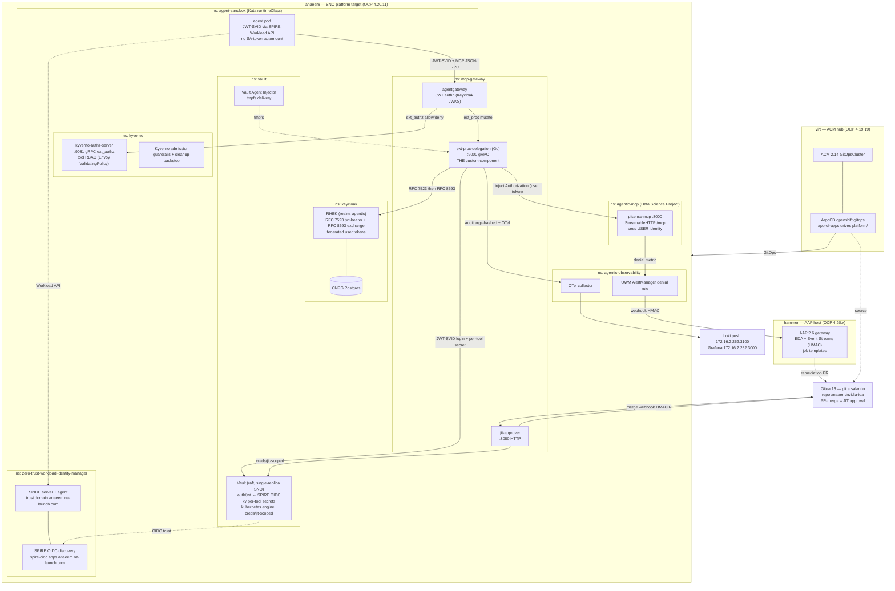

# Architecture

## High-level component diagram

The diagram below shows every component, which cluster it runs on, and the primary communication paths.

---

## Design rationale

### One custom component

The entire credential-delegation critical path rides on a single custom Go binary (`ext-proc-delegation`). Everything else — SPIRE, Keycloak, Vault, agentgateway, Kyverno, Kata — is a vendor-supported component. This is the core supportability argument for a regulated environment: one binary to audit, one binary to maintain.

### extAuthz / extProc split (ADR 0004)

Authorization (allow/deny) and mutation (credential injection) are handled by **separate** filters in the gateway pipeline, enforced in a fixed order:

1. **Kyverno ext_authz** decides allow/deny — it cannot mutate.
2. **ext-proc-delegation** mutates headers — it cannot grant access.

This means a bug in the mutation layer cannot become an access-granting path, and a Kyverno DENY short-circuits before any credential is minted.

### Fail closed everywhere

Both filters are marked **required**. An unreachable or erroring filter produces a `503` to the agent, never a pass-through. Vault Agent Injector blocking an init container means the workload never starts without valid credentials.

### Structural auto-revoke

JIT grants are Vault lease objects. When the lease TTL expires, Vault deletes the SA, Role, and RoleBinding — the token becomes invalid and the identity disappears. There is no cron, reconciler, or human step in the revocation path. Kyverno cleanup is a backstop for orphaned leases only.

---

## Namespace map

| Namespace | Components | NetworkPolicy posture |
|---|---|---|
| `zero-trust-workload-identity-manager` | SPIRE server, SPIRE agent, SPIFFE CSI Driver, OIDC discovery | Default deny; SPIRE agent egress to server:8081; OIDC Route ingress from router |
| `keycloak` | RHBK, CNPG Postgres | Default deny; ingress 8443 from router; egress CNPG:5432, SPIRE OIDC:443 |
| `vault` | Vault (raft), Vault Agent Injector | Default deny; ingress 8200 from `mcp-gateway`, `keycloak`, `agentic-mcp`, `agent-sandbox`; Route ingress for CLI |
| `kyverno` | Kyverno admission, kyverno-authz-server | Default deny; ingress 9081 from `mcp-gateway`; admission webhook from API server |
| `mcp-gateway` | agentgateway, ext-proc-delegation, jit-approver | Default deny; ingress 443 from router; ext-proc:9000 from agentgateway; jit:8080 from ext-proc; webhook Route for Gitea |
| `agentic-mcp` | pfsense-mcp | Default deny; ingress 8000 from `mcp-gateway` only |
| `agent-sandbox` | agent pods (Kata) | Default deny; egress to `mcp-gateway.apps.anaeem.na-launch.com:443` only |
| `agentic-observability` | OTel collector, AlertManager | Default deny; ingress OTLP from platform namespaces; egress to Loki:3100, EDA:443 |

---

## Cross-references

- [UC1 sequence diagram](../use-cases/uc1-credential-delegation.md) — delegated tool call, step by step
- [UC2 sequence diagram](../use-cases/uc2-jit-sub-identity.md) — JIT approval flow, step by step
- [Security model & trust boundaries](../security/index.md) — STRIDE per hop
- [Component pages](../components/index.md) — per-component placement, interfaces, and verify commands
