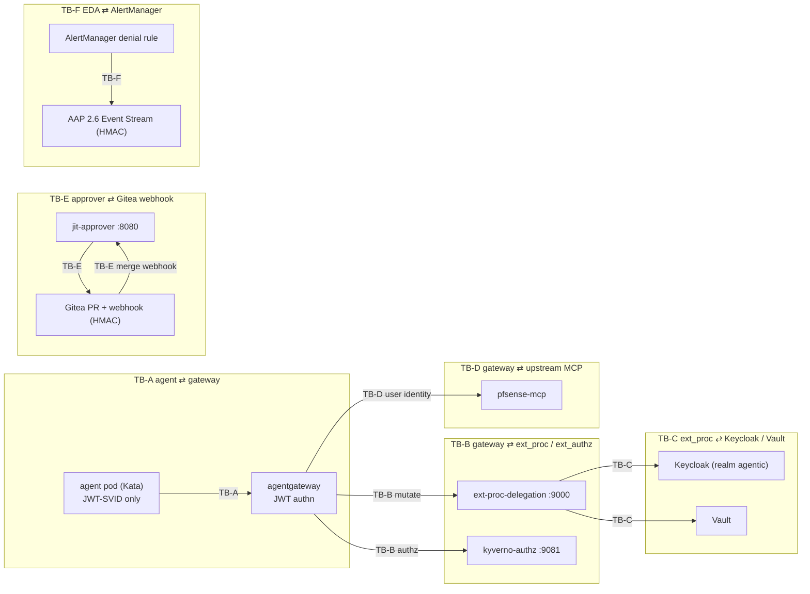

# Security Model

## Posture statement

Every hop in this platform is: **authenticated, fail-closed, least-privilege, and audited**. There is no boundary on which an unauthenticated or unsigned message is trusted. The system is designed so that a compromised agent pod cannot escalate privilege, cannot hold a downstream credential, and cannot forge an approval.

---

## The no-credential-passing invariant

> No credential ever lands in etcd, git, or an agent pod. The agent never holds a usable downstream credential. Downstream systems are reached with the *user's* credential, minted just-in-time and discarded after one request.

This is the central invariant. Every design decision flows from it. It is enforced structurally, not procedurally:

| Boundary | How the invariant is preserved |
|---|---|
| Agent ⇄ gateway | Agent carries only its JWT-SVID (an identity assertion, not a downstream credential); receives a credential-stripped response |
| Gateway ⇄ ext_proc | Mutation happens server-side in the gateway data path; the agent never observes the injected header |
| ext_proc ⇄ Keycloak/Vault | Tokens and secrets are fetched into memory for the lifetime of one request and never written down or logged |
| Gateway ⇄ upstream MCP | Upstream receives the user token; agent SVID is cleared; response headers stripped |
| Approver ⇄ Gitea | Approval travels as a git merge; the secret (ephemeral SA token) is minted server-side by Vault and delivered to the pod via tmpfs, never via git/webhook |
| EDA ⇄ AlertManager | Remediation is a PR; no credential rides the alert or the job |

**Verification hooks.** The invariant is provable by: pod inspection (no Secret volumes on agent pod), upstream-log assertion (subject = user), response cred-echo test (no auth header on response), Kube audit attribution (UC2 calls attributed to `jit-<session>` SA), and git/etcd scan (no credential material committed).

---

## Trust boundaries

The **credential frontier** runs through TB-C and TB-E: credentials exist only inside those boundaries (in ext-proc-delegation memory and in Vault). They never cross back into TB-A (the agent), never appear in TB-D as the agent's credential, and never enter git or etcd.

---

## STRIDE analysis

### TB-A — Agent ⇄ gateway

| Threat | Mitigation |
|---|---|
| **Spoofing** — agent forges another workload's SVID | SVID is a SPIRE-issued JWT validated against SPIRE OIDC JWKS; subject is bound to `ns/sa` |
| **Tampering** — agent mutates JSON-RPC body to call an unapproved tool | Kyverno ext_authz re-derives tool from the parsed body, not a header the agent controls |
| **Repudiation** — agent denies making a call | OTel span + Loki audit keyed to SVID subject + session; args sha256-hashed and logged |
| **Information disclosure** — agent reads a credential off the wire | Agent never receives a credential; response is credential-stripped at TB-D |
| **Denial of service** — agent floods gateway or sends oversized bodies | `maxRequestBytes` body cap; gateway rate limits; Kata pod resource limits |
| **Elevation** — agent self-asserts scope | No scope assertion trusted on TB-A; elevation only via UC2 human-approved path |

### TB-B — Gateway ⇄ ext_proc and ext_authz

| Threat | Mitigation |
|---|---|
| **Spoofing** — rogue pod impersonates the authz or ext_proc service | In-cluster service identity; default-deny NetworkPolicy allows only agentgateway → `:9081` and `:9000` |
| **Tampering** — metadata `dev.agentgateway.jwt` tampered between authn and ext_proc | Same gateway process populates and consumes it; ext_proc re-validates claim integrity |
| **Repudiation** — policy decision unlogged | Kyverno emits PolicyReports; ext_proc emits an audit event per request |
| **Information disclosure** — ext_proc leaks parsed args | Args hashed before logging; bodies held in memory only, never persisted |
| **Denial of service** — slow or unreachable Kyverno or ext_proc | **Fail closed** — gateway denies if either filter errors or times out; both are required filters |
| **Elevation** — extProc-mode policy used to bypass authz | Clear split (ADR 0004): Kyverno owns allow/deny; delegation owns mutation only |

### TB-C — ext_proc ⇄ Keycloak / Vault

| Threat | Mitigation |
|---|---|
| **Spoofing** — ext_proc impersonates a user without authorization | Keycloak RFC 7523/8693 requires the inbound SVID as the actor token; exchange bounded by realm client config and downstream audience allowlist |
| **Tampering** — token altered in transit | TLS to Keycloak/Vault; tokens are signed JWTs (signature checked downstream) |
| **Repudiation** — token issuance unaudited | Keycloak event log + ext_proc audit span record exchange (subject, actor, audience, jti) |
| **Information disclosure** — Vault secret or token logged | Secrets held in memory for one request; never logged; audit records the fact of issuance, not the value |
| **Denial of service** — Keycloak or Vault outage halts MCP traffic | Fail-closed by design; HA documented for production; `mode: standard|legacy` fallback (ADR 0003) |
| **Elevation** — ext_proc requests broader audience or scope | Per-tool audience + Vault path mapping; Vault policy limits readable secret paths by SVID |

### TB-D — Gateway ⇄ upstream MCP

| Threat | Mitigation |
|---|---|
| **Spoofing** — upstream sees the agent rather than the user | Injected `Authorization` carries the user token (RFC 8693 to downstream audience); agent SVID cleared |
| **Tampering** — response body modified to carry a credential | Response leg strips auth/credential headers; body-proc SKIP by default |
| **Repudiation** — upstream action not tied to a user | Upstream sees user subject; ext_proc audit ties request → user → upstream |
| **Information disclosure** — credential echoed back in MCP response | Strip credential headers on response + cred-echo test |
| **Denial of service** — upstream slowness back-pressures gateway | Timeouts + circuit-break on upstream; failures do not leak partial credentials |
| **Elevation** — reused user token for a tool the user lacks | Tool RBAC enforced at TB-B (Kyverno ext_authz) before the exchange happens |

### TB-E — Approver ⇄ Gitea webhook

| Threat | Mitigation |
|---|---|
| **Spoofing** — attacker posts a fake "merge" webhook | HMAC signature verification + repo allowlist (`anaeem/nvidia-ida` only) + merged-PR event type |
| **Tampering** — payload altered to widen scope | Grant scope re-read from the committed PR manifest in git, not the webhook body |
| **Repudiation** — approver denies approving | The merge is a signed git commit by an authenticated Gitea user; PR + commit author is the immutable record |
| **Information disclosure** — webhook leaks secrets | Webhook payload carries no secrets; Vault issuance happens server-side |
| **Denial of service** — webhook flood | HMAC + allowlist reject unsigned/foreign payloads cheaply; rate limit on `:8080` |
| **Elevation** — merge of an over-ceiling grant | jit-approver re-validates scope against ceiling before calling Vault; over-ceiling rejected even if merged |

### TB-F — EDA ⇄ AlertManager

| Threat | Mitigation |
|---|---|
| **Spoofing** — fake alert triggers a remediation job | AAP Event Stream is HMAC-authenticated; AlertManager → Event Stream over TLS |
| **Tampering** — alert payload altered to widen remediation | Rulebook maps alerts to a fixed, reviewed job-template set; remediation lands as a PR, not a direct change |
| **Repudiation** — no record of what triggered remediation | Event Stream + AAP job logs + the resulting PR carry full provenance |
| **Information disclosure** — logs in the PR leak secrets | Job templates redact; secrets stay in Vault |
| **Denial of service** — alert storm spawns job storm | EDA throttling/dedup; job concurrency caps |
| **Elevation** — remediation runs with standing elevated access | No standing elevated access — remediation is a PR requiring a human merge (same HITL gate as UC2) |

---

## Abuse cases

| # | Abuse case | Mitigation | Provable by |
|---|---|---|---|
| 1 | **Forged PR-merge webhook** → silent JIT grant | HMAC verification + repo allowlist + scope re-read from committed manifest | Negative test: unsigned/foreign-repo webhook → 401/403, no Vault call |
| 2 | **Agent self-issues elevated access** | Vault policy grants `creds/jit-scoped` to approver service identity only; agent SVID has no path | Negative test: agent Vault login cannot read `kubernetes/creds/jit-scoped` |
| 3 | **Credential echoed in MCP response** | Response leg strips auth/credential headers; body-proc SKIP by default | Unit + integration test: injected header absent from agent-visible response |
| 4 | **Scope creep / silent escalation** | Scope ceiling at request time + new-request rule + post-merge ceiling re-check | Negative test: over-ceiling request rejected pre-Vault; follow-on requires new PR |
| 5 | **Stale grant outlives its window** | Structural auto-revoke: Vault lease TTL deletes SA+Role+RoleBinding | Kube-audit test: access denied after TTL; SA/Role/RoleBinding gone |
| 6 | **Policy bypass via filter failure** | Fail-closed: required filters; any error → request denied | Chaos test: kill authz/ext_proc → requests denied, not allowed |

---

## Residual risk

!!! warning "Carry to sign-off"

    - **Immature critical-path pieces** — agentgateway alpha CRDs, RHBK RFC 7523 preview, ZTWIM channel level. Mitigated by pinning, vendored CRDs, and the `standard|legacy` exchange fallback, but they remain the top residual risk.
    - **Single-replica Vault on SNO** — availability single point on the credential path; fail-closed turns a Vault outage into a hard MCP-traffic stop. HA documented for production.
    - **ext_proc body buffering** — per-call latency and a memory surface; bounded by `maxRequestBytes`, body-proc SKIP on the response, distroless non-root image.
    - **In-memory approval state in jit-approver** — a pod restart loses pending approvals; a persistent queue (Redis or CNPG) is the production path.

---

## Related pages

- [UC1 walkthrough](../use-cases/uc1-credential-delegation.md) — credential delegation end to end
- [UC2 walkthrough](../use-cases/uc2-jit-sub-identity.md) — JIT approval flow end to end
- [ADR 0004 — extProc vs extAuthz split](../decisions/0004-extproc-vs-extauthz-split.md)
- [ADR 0005 — Gitea PR approval gate](../decisions/0005-no-slack-gitea-pr-approval.md)
- [ADR 0006 — JIT session-capability JWT](../decisions/0006-jit-session-capability-jwt.md)
