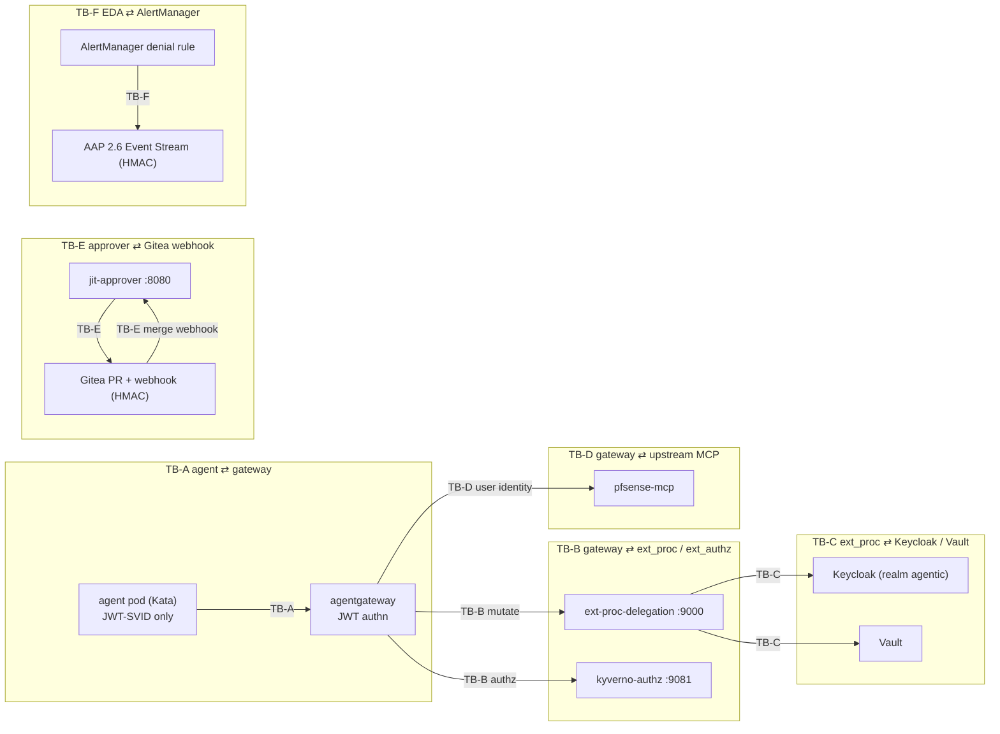

# Threat Model — Zero-Trust Agentic AI Platform (PoC)

Scope: the UC1 delegated tool-call path and the UC2 JIT-escalation path on the **anaeem**
cluster, plus the EDA self-healing loop spanning **hammer** (AAP) and Gitea. Method: trust
boundaries first, then STRIDE per boundary, then the cross-cutting **no-credential-passing
invariant** and how each boundary preserves it, then named abuse cases with mitigations.

Posture for every boundary: **authenticated, fail-closed, least-privilege, audited**. There
is no boundary on which an unauthenticated or unsigned message is trusted.

---

## 1. Trust boundaries diagram

The dotted line through the whole picture is the **credential frontier**: credentials exist
only inside TB-C↔delegation memory and TB-E↔Vault. They never cross back into TB-A (agent),
never land in TB-D upstream as the *agent's* credential, and never appear in git/etcd.

---

## 2. STRIDE per boundary

### TB-A — agent ⇄ gateway

| STRIDE | Threat | Mitigation |
|---|---|---|
| **S**poofing | Agent forges another workload's SVID or a user context | SVID is a SPIRE-issued JWT validated at the gateway against SPIRE OIDC JWKS; SVID subject is bound to `ns/sa`; user context is a claim that must be present, not asserted by the agent unilaterally |
| **T**ampering | Agent mutates JSON-RPC body to call an un-approved tool | extAuthz (Kyverno) re-derives tool from the parsed body, not from a header the agent controls; mismatch = deny |
| **R**epudiation | Agent denies making a call | OTel span + Loki audit keyed to SVID subject + session; args sha256-hashed and logged |
| **I**nfo disclosure | Agent reads a credential off the wire | Agent never receives a credential on this hop; response is credential-stripped (TB-D) |
| **D**oS | Agent floods gateway / oversized bodies | `maxRequestBytes` body cap; gateway rate limits; Kata pod resource limits |
| **E**levation | Agent escalates by self-asserting scope | No scope assertion is trusted on TB-A; elevation only via UC2 human-approved path |

### TB-B — gateway ⇄ ext_proc (mutation) and ext_authz (allow/deny)

| STRIDE | Threat | Mitigation |
|---|---|---|
| **S**poofing | A rogue pod impersonates the authz/ext_proc service | mTLS / in-cluster service identity; default-deny NetworkPolicy allows only agentgateway → `:9081` and `:9000` |
| **T**ampering | Metadata `dev.agentgateway.jwt` tampered between authn and ext_proc | Same gateway process populates and consumes it; ext_proc re-validates claim integrity before use |
| **R**epudiation | Policy decision unlogged | Kyverno emits PolicyReports; ext_proc emits audit event per request |
| **I**nfo disclosure | ext_proc leaks parsed args | Args hashed before logging; bodies held in memory only, never persisted |
| **D**oS | Slow/unreachable Kyverno or ext_proc | **Fail closed** — gateway denies the request if either filter errors or times out; both are *required* filters |
| **E**levation | extProc-mode policy used to bypass authz | Clear split (ADR 0004): Kyverno on **extAuthz** owns allow/deny; delegation on **extProc** does mutation only and cannot grant access |

### TB-C — ext_proc ⇄ Keycloak / Vault

| STRIDE | Threat | Mitigation |
|---|---|---|
| **S**poofing | ext_proc impersonates a user without authorization | Keycloak RFC 7523/8693 requires the inbound SVID as the actor token; exchange bounded by realm client config + downstream audience allowlist |
| **T**ampering | Token altered in transit | TLS to Keycloak/Vault; tokens are signed JWTs (signature checked downstream) |
| **R**epudiation | Token issuance unaudited | Keycloak event log + ext_proc audit span record exchange (subject, actor, audience, jti) |
| **I**nfo disclosure | Vault secret or token logged/echoed | Secrets held in memory for one request; never logged; audit logs the *fact* of issuance, not the value |
| **D**oS | Keycloak/Vault outage halts MCP traffic | Acknowledged weakness; fail-closed by design; HA documented for prod; `mode: standard|legacy` fallback for the exchange leg (ADR 0003) |
| **E**levation | ext_proc requests a broader audience/scope than the tool needs | Per-tool audience + Vault path mapping; Vault policy on ext_proc SVID limits readable secret paths |

### TB-D — gateway ⇄ upstream MCP (pfsense-mcp)

| STRIDE | Threat | Mitigation |
|---|---|---|
| **S**poofing | Upstream sees the agent rather than the user | Injected `Authorization` carries the **user** token (RFC 8693 to downstream audience); agent SVID cleared before forwarding — proven by upstream logs |
| **T**ampering | Response body modified to carry a credential | Response leg strips auth/credential headers; body-proc SKIP by default (no untrusted body mutation) |
| **R**epudiation | Upstream action not tied to a user | Upstream sees user subject; ext_proc audit ties request→user→upstream |
| **I**nfo disclosure | Credential echoed back in MCP response | **Strip credential headers on response + cred-echo test** (abuse case 3) |
| **D**oS | Upstream slowness back-pressures gateway | Timeouts + circuit-break on upstream; failures do not leak partial creds |
| **E**levation | Reused user token for a tool the user lacks | Tool RBAC already enforced at TB-B before the exchange happens |

### TB-E — approver ⇄ Gitea webhook

| STRIDE | Threat | Mitigation |
|---|---|---|
| **S**poofing | Attacker posts a fake "merge" webhook | **HMAC signature verification** on every webhook + repo allowlist (only `anaeem/nvidia-ida`) + event-type allowlist (merged PR only) |
| **T**ampering | Payload altered to widen scope | Grant scope is read from the merged PR's committed manifest in git, not from the webhook body; webhook only signals "this PR merged" |
| **R**epudiation | Approver denies approving | The merge is a signed git commit by an authenticated Gitea user; PR + commit author is the immutable approval record |
| **I**nfo disclosure | Webhook leaks secrets | Webhook payload carries no secrets; Vault issuance happens server-side in jit-approver |
| **D**oS | Webhook flood | HMAC + allowlist reject unsigned/foreign payloads cheaply; rate limit on `:8080` |
| **E**levation | Merge of an over-ceiling grant | jit-approver re-validates the merged scope against the ceiling before calling Vault; over-ceiling = rejected even if merged |

### TB-F — EDA ⇄ AlertManager

| STRIDE | Threat | Mitigation |
|---|---|---|
| **S**poofing | Fake alert triggers a remediation job | AAP Event Stream is **HMAC-authenticated**; AlertManager → Event Stream over TLS |
| **T**ampering | Alert payload altered to widen remediation | Rulebook maps alerts to a fixed, reviewed job-template set; remediation lands as a **PR**, not a direct change |
| **R**epudiation | No record of what triggered remediation | Event Stream + AAP job logs + the resulting PR carry full provenance |
| **I**nfo disclosure | Logs in the PR leak secrets | Job templates redact; secrets stay in Vault, never in PR bodies |
| **D**oS | Alert storm spawns job storm | EDA throttling/dedup; job concurrency caps |
| **E**levation | Remediation runs with standing elevated access | No standing elevated access — remediation is a PR that a human must merge (same HITL gate as UC2) |

---

## 3. The no-credential-passing invariant — per-boundary preservation

> **Invariant.** No credential ever lands in etcd, git, or an agent pod; the agent never
> holds a usable downstream credential; downstream systems are reached with the *user's*
> credential, minted just-in-time and discarded after one request.

| Boundary | How the invariant is preserved |
|---|---|
| TB-A agent⇄gateway | Agent carries only its JWT-SVID (an identity assertion, not a downstream credential); receives a credential-stripped response |
| TB-B gateway⇄ext_proc | Mutation happens server-side in the gateway data path; the agent never observes the injected header |
| TB-C ext_proc⇄IdP | Tokens/secrets are fetched into ext_proc memory for the lifetime of one request and never written down or logged (only their issuance is audited) |
| TB-D gateway⇄upstream | Upstream receives the **user** token; agent SVID is cleared; response headers stripped so no credential returns to the agent |
| TB-E approver⇄Gitea | Approval travels as a git merge; the **secret** (ephemeral SA token) is minted by Vault server-side and delivered to the pod via the injector on **tmpfs**, never via git/webhook |
| TB-F EDA⇄AlertManager | Remediation is a PR; no credential rides the alert or the job; Vault remains the only secret source |

Verification hooks: pod-inspection test (agent pod has no mounted secret / no SA-token
automount), upstream-log assertion (subject = user), response cred-echo test (no
auth/credential header on the response), Kube-audit attribution test (UC2 calls attributed
to `jit-<session>` SA), and a git/etcd scan asserting no credential material is committed.

---

## 4. Abuse cases

| # | Abuse case | Vector | Mitigation | Provable by |
|---|---|---|---|---|
| 1 | **Forged PR-merge webhook** → silent JIT grant | Attacker POSTs a crafted "PR merged" event to `jit-approver` | **HMAC verification** (shared secret) **+ repo allowlist** (`anaeem/nvidia-ida` only) + merged-PR event-type check; scope re-read from committed manifest | Negative test: unsigned/foreign-repo webhook → 401/403, no Vault call |
| 2 | **Agent self-issues elevated access** | Agent tries to call Vault `creds/jit-scoped` directly | **Vault policy** grants the creds endpoint to the **approver service identity only**; agent SVID has no path to it | Negative test: agent Vault login cannot read `kubernetes/creds/jit-scoped` |
| 3 | **Credential echoed in MCP response** | Upstream (or a malicious tool) returns a credential in a response header/body | Response leg **strips** auth/credential headers; body-proc SKIP by default; explicit **cred-echo test** asserts none returns | Unit + integration test: injected header absent from agent-visible response |
| 4 | **Scope creep / silent escalation** | Agent widens an already-granted scope, or chains a riskier follow-on | **Scope ceiling** enforced at request time + **new-request rule** (any riskier follow-on = a fresh approval, never an in-place widen); jit-approver rejects over-ceiling even if a PR merged | Negative test: over-ceiling request rejected pre-Vault; follow-on requires new PR |
| 5 | **Stale grant outlives its window** | Revocation missed/skipped | **Structural auto-revoke**: Vault lease TTL deletes SA+Role+RoleBinding; Kyverno cleanup is a backstop, not the primary path | Kube-audit test: access denied after TTL; SA/Role/RoleBinding gone |
| 6 | **Policy/delegation bypass via filter failure** | Attacker induces Kyverno or ext_proc to error to "fail open" | **Fail closed**: required filters; any filter error → request denied | Chaos test: kill authz/ext_proc → requests denied, not allowed |

---

## 5. Residual risk (carry to SWOT / sign-off)

- **Immature critical-path pieces** — agentgateway alpha CRDs, RHBK RFC 7523 preview, ZTWIM
  channel level. Mitigated by pinning, vendored CRDs, and the `standard|legacy` exchange
  fallback (ADR 0003), but they remain the top residual risk.
- **Single-replica Vault on SNO** — availability/latency single point on the credential path;
  fail-closed turns a Vault outage into a hard MCP-traffic stop. HA documented for prod.
- **ext_proc body buffering** — per-call latency and a memory surface; bounded by
  `maxRequestBytes`, body-proc SKIP on the response, distroless non-root image.

See [swot.md](./swot.md) for the consolidated Threats list and the PoC sign-off gate.
